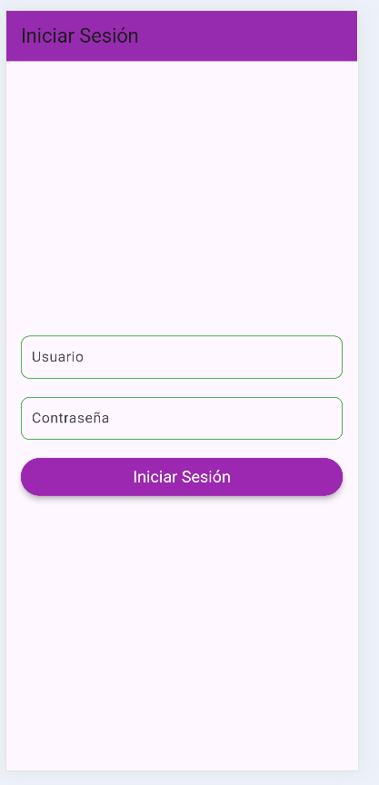

Instrucciones de ejecucion

Requisitos previos
-Descargar e instalar flutter
-Entorno de desarrollo
-El repositorio clonado
-Obtener las dependencias "flutter pub get"
-Verifiar configuracion "flutter doctor"
-Configurar el dispositivo emulador 

-Tener en el "pubspec.yaml" las siguientes dependencias
  cupertino_icons: ^1.0.8
  intl: ^0.19.0 
  sqflite: ^2.3.3 
  path: ^1.9.0 
  sqflite_common_ffi: ^2.3.0
  sqflite_common_ffi_web: ^0.4.0 
  provider: ^6.1.2 
  shared_preferences: ^2.2.3 

-En la terminal podemos ejecutar el comando "flutter run" y escogemos el emulador para ejecutar la aplicacion o 
 nos podemos dirigir a la vista main y lo ejecutamos por medio del debugger con el icono que se muestra en la foto 
 en este caso visual studio code o presionando F5
 

Patron de arquitectura utilizado

-main: Punto de entrada, configura los "Providers" y la estructura de la app. 

-config: Contiene la configuración global, como: 
  -routes: Define las rutas de navegación de forma centralizada para mayor orden.
  -themes: Define el estilo visual global de la aplicación.

-data: Capa de datos, encargada de cómo se obtienen y almacenan los datos. 
  -models: Define las estructuras de los datos (DataModel) con serialización y métodos de ayuda.
  -repositories: Define el (DataRepository) para operaciones de datos (CRUD), y fake_data_repository es la implementación que simula esos datos.
  -domain: Capa de lógica de negocio y estado global. 
  -providers: Usa "Provider" para gestionar el estado de la aplicación. AuthProvider maneja la autenticación y DataProvider gestiona el estado de los datos, usando el "repositorio" para las operaciones.
  -views: Capa de presentación (UI) que interactúa con el usuario. 
    -screens: Contiene todas las pantallas de la aplicación (form_screen para crear/editar, list_screen para mostrar la lista, login_screen para autenticación, view_screen para ver detalles).
    -widgets: Contiene componentes de UI reutilizables (custom_text).

Ejemplo de uso

-Al ingresar nos vamos a encontrar con el loguin

 alli debemos ingresar las credencias que son "user" y "password" respectivamente

-Al ingresar a la panel nos vamos a encontrar el listado de las tareas  

en donde podremos observar las tareas que hay con su respectiva informacion cada una 

-El icono del ojo es para visualizarla
-El icono del lapiz es para editarla 
-El icono inferior derecho con el signo + es para crear una nueva tarea
-El icono de la parte derecha superior es para desloguearse
-Y para eliminarla simplemente deslizamos a la derecha y aceptamos el moodal
